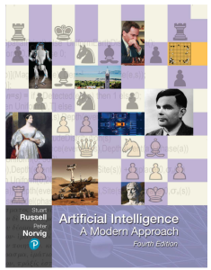
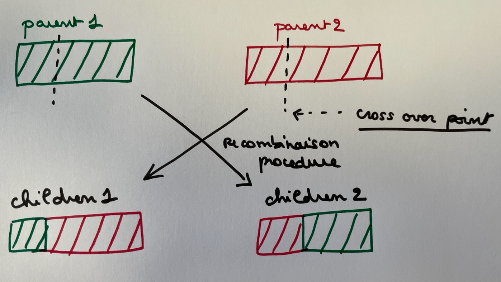
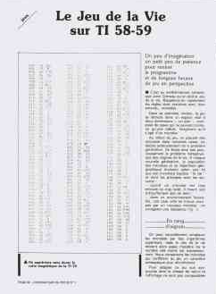

# AiAndGo

Most of the examples are based on the following book:

Artificial Intelligence
A Modern Approach
Fourth Edition
Stuart J. Russell and Peter Norvig

# IAEvolutionaryAlgo1

IN PROGRESS

There is a population of individuals (states) in which the fittest (highest value) individuals produce offspring (successor states) that populate the next generation, a process called recombination

There are endless forms of evolutionary algorithms, varying in the following ways:

The size of the population
The representation of each individual
In genetic algorithms, each individual is a string over a finite alphabet
The mixing number, , which is the number of parents that come together to form offspring. The most common case is 2 !

The selection process for selecting the individuals who will become the parents of the next generation
The recombination procedure.
Exemple :  select a crossover point to split each of the parent strings, and recombine the parts to
form two children, one with the first part of parent 1 and the second part of parent 2;
the other with the second part of parent 1 and the first part of parent 2.

The mutation rate, which determines how often offspring have random mutations to their representation.
The makeup of the next generation. This can be just the newly formed offspring.
it can include a few top-scoring parents from the previous generation (Elitism)
all individuals below a given threshold are discarded (Culling)

Ce que fait le code de l'algo :

step 1 : Generation aléatoire d'une population de départ de 100 individus
population <-- [1001110110, 1100000101, 1010011100, ..... 1101101001]

On se donne un individu cible , celui que l'on cherche à obtenir au bout de x generations
individu target <-- [1101000011]

Exemple: Avec un taux de  mutation de 1%.

Population aléatoire de 100 individus --> [1101111101,0101100001,1011111110, ...., 1100101101]

target individu --> 1101000011
generation 0 best individual -->1001000111

generation 1 best individual -->1101010001

generation 2 best individual -->1101100001

generation 3 best individual -->1101100011

generation 4 best individual -->1101100011

generation 5 best individual -->1101100011

generation 6 best individual -->1101100011

generation 7 best individual -->1101100011

L'individu est obtenu au bout de  8 generations: 1101000011

# Cellular Automaton (Game of Life)

The Code of the Game of Life (1970: John Conway Always and Again) was proposed in the magazine "L'ordinateur de poche" in April 1981

I always have the magazine at home on this complete Turing cellular automaton

158 bytes on Ti58 !!!

rules : --> 

Une cellule vivante avec moins de 2 voisins vivants meurt (sous-population).

Une cellule vivante avec 2 ou 3 voisins vivants reste vivante.

Une cellule vivante avec plus de 3 voisins vivants meurt (surpopulation).

Une cellule morte avec exactement 3 voisins vivants devient vivante (reproduction).

## Remark :

- The actual mechanisms of evolution are, however, far far richer than most genetic algorithms allow
For the example of our cellular automaton , mutations can involve reversals, duplications, and movement of large chunks of DNA
- Biology is in the situation of physics before the quantum revolution. A new theory of evolution is missing.
- Let's hope that this new theory will be available in the 21st century : some new theories here :
- - Denton, D'Arcy Thompson: There are Platonic forms or archetypes in nature and mathematical laws influencing the forms of living beings.

- - Conway-Morris, de Duve: the evolution of life would in one way or another be channeled towards increasingly complex forms leading to the existence of conscious beings.

- - Schützenberger: Evolution follows an optimal control algorithm.

